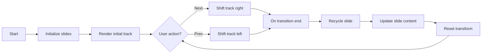

# Infinite Carousel

A minimal, responsive *infinite* carousel implemented in plain HTML, CSS, and JavaScript.

## Overview

The carousel maintains a constant number of DOM nodes and reuses them as the user navigates. It keeps a fixed "center" slide and recycles slides by shifting them from one end of the track to the other while updating their content. This approach keeps performance stable even when the user navigates far beyond the initial set of images.

## How it works

1. A fixed number of slide elements (`VISIBLE_SLIDES`) is created on init.
2. The `track` is translated horizontally to center the active slide.
3. When navigation occurs, the active index is updated, a slide shift animation runs, and once the transition ends, the off-screen slide is recycled and updated with new image data.

### Key concepts

- **Virtual index**: A logical index that increments/decrements indefinitely. It is mapped back into the finite `IMAGES` array using modular arithmetic.
- **Recycling**: Only `VISIBLE_SLIDES` elements exist in the DOM. After each move, one element is moved from one end to the other and its content is updated.

## Configuration

Most configuration is in `index.html` under the script section.

### Visual configuration (CSS variables)

The following CSS variables can be adjusted in the `<style>` block:

- `--slide-w`: slide width
- `--gap`: spacing around each slide
- `--speed`: transition duration
- `--easing`: transition timing function
- `--scale`: scale factor applied to the centered slide

### Behavioral configuration (JavaScript)

Key constants in the script:

- `IMAGES`: array of image URLs.
- `SLIDE_WIDTH`: must match `--slide-w` in CSS.
- `GAP`: must match `--gap` in CSS.
- `VISIBLE_SLIDES`: number of slide elements kept in the DOM.
- `AUTOPLAY_MS`: interval for autoplay.

## Extending the carousel

### Change image set

Update the `IMAGES` array in `index.html`.

### Adjust slide count

Increase or decrease `VISIBLE_SLIDES` to modify how many slide elements are rendered. Keep it odd so the center slide is well-defined.

### Custom navigation

The carousel exposes no public API in the current implementation (self-contained script). Add helper functions for programmatic control if needed.

## Diagram (Mermaid)

## Notes

- The carousel is designed for modern browsers; it uses `translate3d` and `transitionend`.
- To avoid layout shifts, the script recalculates the transform on `resize`.
- The autoplay toggle is implemented with a simple interval; pause the page or disable autoplay to conserve CPU.
